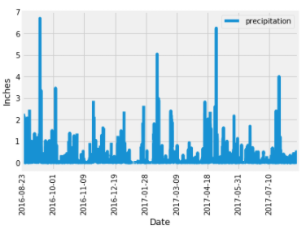
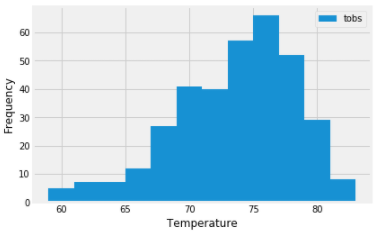
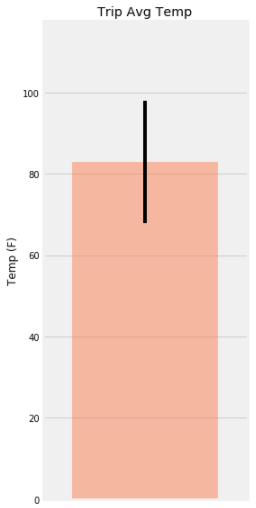
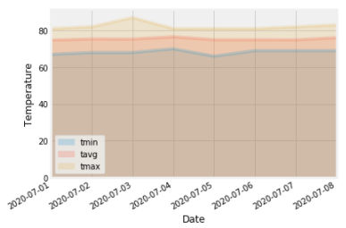

# Climate Analysis and Data Exploration

I need a vacation! How about a trip to Hawaii to fulfill the need. But first, let's make sure the weather will be just right for the dates I plan on being there.

I used Python and SQLAlchemy to do some climate analysis and data exploration on Hawaii's climate database. 

## Precipitation Analysis

Selecting only the `data` and `prcp` values, I designed a query to retrieve the last 12 months of precipitation data and then ploted the results.

## Station Analysis

Designed a query to calculate the total number of stations and to determine which ones were the most active.

## Temperature Analysis

Used the `calc_temps` function to calculate the min, avg, and max temperatures for my trip using the matching dates from 2017.

## Daily Rainfall Average

Calculated the rainfall per weather station using 2019's matching dates.

Calculated the daily normals. Normals are the averages for the min, avg, and max temperatures.

Created a list of dates for my trip in the format `%m-%d`. Used the `daily_normals` function to calculate the normals for each date string and appended the results to a list.

Loaded the list of daily normals into a Pandas DataFrame and set the index equal to the date.

Used Pandas to plot an area plot (`stacked=False`) for the daily normals.

  
Turns out the first week of July is ideal for my much needed vactation. Off I go!

